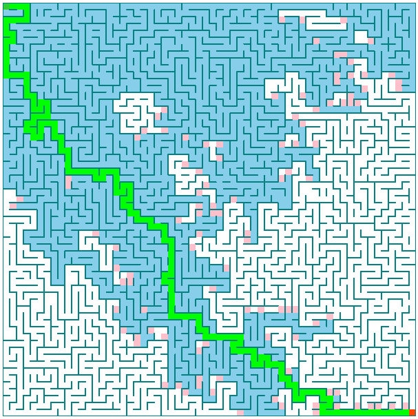

# Solving No Dead Ends mazes using A* search

## Live Demo [Click Me !!](https://thenirmalkc.github.io/maze-solving-algorithm-astar/)

## Implementation

**No Dead Ends Maze** are the maze that has multiple path from starting node to goal node. Here I used **A* search** to solve the maze. **A* search** not only solves the maze but it gives the most optimal path ( i.e. the shortest path ) from start node to end node.
_**Notes:**_
  - The distance between node and its neighbour node is 1 unit.
  - The heuristic function returns the **Manhatten Distance** between the current node and end node.
  
_**A new maze is generated after 4 seconds when a maze is solved.**_
